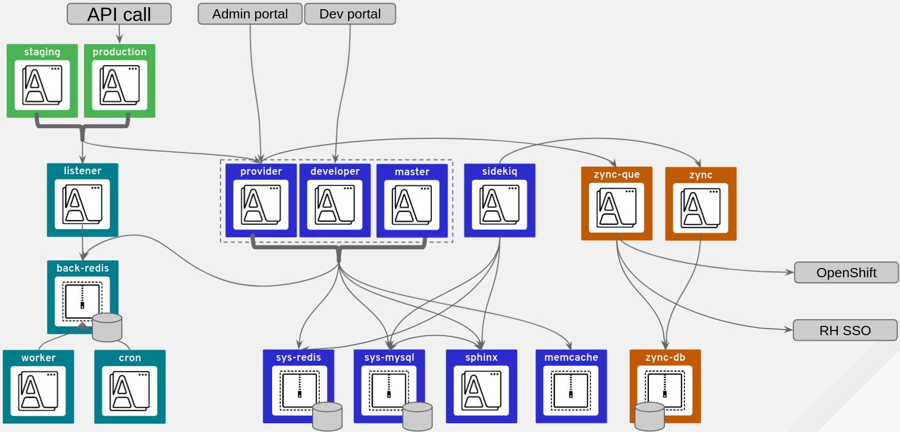

= 3scale Operations

This repository contains documentation and tools to help in the installation, operation, ongoing Maintenance and upgrade of an instance of 3scale API Management, whether you are deploying it in a *public cloud*, *private cloud* or *on-premises*.

This documentation assumes familiarity with the main components of the 3scale architecture. If you would like to learn more about them, please check their upstream repositories:

* link:https://github.com/3scale/apicast[apicast]
* link:https://github.com/3scale/apisonator[apisonator (also known as "backend")]
* link:https://github.com/3scale/porta[porta (also known as "system")]
* link:https://github.com/3scale/zync[zync]

It also assumes that you are installing 3scale on link:https://www.openshift.com/[Red Hat OpenShift] using the link:https://github.com/3scale/3scale-operator[3scale Operator].

Sections will be added over time and updated when relevant changes are made in 3scale or
specific platforms it runs on.

== Architecture

== Operations

Documents in this section describe typical operation procedures once you have your 3scale installation up and running:

* link:docs/components.adoc[Components responsibilities and impact when down]
* link:docs/backups.adoc[Backup & Restore procedures]
* link:docs/observability.adoc[Observability: Apps & Databases]
* link:docs/ha.adoc[High-Availability]