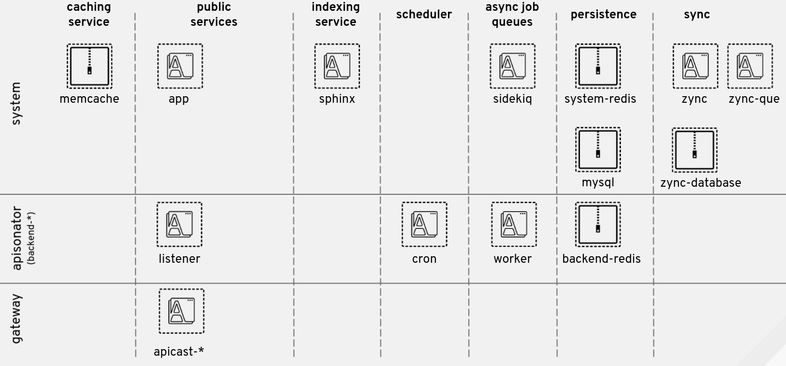

:toc:
:toc-placement!:

= Components

This section explains what the responsibilities of every 3scale component are and what is the impact when each of them is not available.

toc::[]

== apicast-production

=== Responsibilities
* 3scale API Gateway
* APIcast enforces traffic policies, either returning an error or proxying the API call to the customer’s API backend
* APIcast fetches its operating configuration from `system-app` component when the gateway starts
* Each incoming/managed API call produces a sync/auth request from the API Gateway to `backend-listener`
* Reduces latency by introducing the API Gateway in the traffic flow

=== Impact when down
* Clients will not be able to reach the provider's API using that APIcast instance

== apicast-staging

=== Responsibilities
* Same as `apicast-production`, but affecting staging traffic

=== Impact when down
* Same as `apicast-production`, but affecting staging traffic

== backend-listener

=== Responsibilities
* This is the most critical component, responsible for authorizing and rate-limiting requests

=== Impact when down
* APIcast will not be able to tell whether a request should be authorized or not and simply denies everything
* APIs configured using 3scale are down
* This service distuption can be mitigated by using the APIcast auth caching policy. There are some trade-offs when using this policy (service availability upon possible outages vs. service available but possibly using outdated configuration), so make sure you understand the implications before using it

== backend-worker

=== Responsibilities
* Process the background jobs created by `backend-listener`
* Runs enqueued jobs, mainly related to traffic reporting

=== Impact when down
* Reported metrics can't be made effective, so the rate-limiting functionality loses accuracy because those pending reports are not taken into account
* Statistics will not be up to date and the alerts and errors shown in the admin portal will not be triggered
* Because accounting will not work, authorizations will not be correct
* Jobs will not be processed and will start accumulating in `backend-redis`, which could lead to database out of memory related problems

== backend-cron

=== Responsibilities
* This is a simple task that acts as a cron like scheduler to retry failed jobs
* When a `backend-worker` job fails, it is pushed to a "failed jobs" queue so that it can be retried later. Jobs can fail, for example, when there's a Redis timeout
* It is also responsible for deleting the stats of services that have been removed. This is run every 24h

=== Impact when down
* Failed jobs will not be rescheduled
* If it crashes in the middle of the delete process, it will just continue the next time it runs
* If the 3scale installation is working correctly, the failed jobs queue will be empty at almost all times, so `backend-cron` being down is not critical

== backend-redis

=== Responsibilities
* It is the database used by `backend-listener` and `backend-worker`
* It is used both for data persistence (metrics...) and to store job queues

=== Impact when down
* `backend-listener` and `backend-worker` cannot function without access to the storage, so both components can be considered as down. Refer to the sections on `backend-listener` and `backend-worker` to review impact when these components are down

== system-app

=== Responsibilities
* Developer and Admin Portal UI/API
* 3scale APIs (Accounts, Analytics)

=== Impact when down
* Developer and Admin Portal UI/API will not be available
* 3scale APIs (Accounts, Analytics) will not be available
* `apicast` will not be able to retrieve the gateway configuration, so new `apicast` deployments will not work
* Already running `apicast` Pods will continue serving traffic using the latest retrieved configuration (cached)

== system-sidekiq

=== Responsibilities
* It is the job manager used by `system-app` to process jobs in the background asynchronously

=== Impact when down
* Emails are not sent
* Communication with `backend-listener` breaks: changes in Admin Portal will not propagate to Backend
* Backend alerts will not be triggered
* Webhooks will not be triggered
* Zync will not receive any updates
* Background jobs will not be processed and will start accumulating in `system-redis`, which could lead to database out of memory related problems

== system-mysql or system-postgresql

=== Responsibilities
* It is the main relational database used by `system-app`

=== Impact when down
* Both `system-app` and `system-sidekiq` components can be considered down if access to the relational database is lost. Refer to the sections on `system-app` and `system-sidekiq` to review impact when these components are down

== system-redis

=== Responsibilities
* It is the database used by `system-app` to enqueue the jobs consumed by `system-sidekiq`

=== Impact when down
* `system-app` and `system-sidekiq` cannot function without access to the storage, so both components can be considered as down. Refer to the sections on `system-app` and `system-sidekiq` to review impact when these components are down

== system-memcache

=== Responsibilities
* `system-memcached` is an ephemeral cache of values used to speed-up the performance of the `system-app` web application

=== Impact when down
* `system-app` will run slightly slower (UI page loading times will be worse) while the cache is not accessible. Cache will be rebuilt once the memcached instance is back online

== system-sphinx

=== Responsibilities
* Full-text search for `system-app`

=== Impact when down
* The search functionality on the `system-app` Admin/Developer Portal (accounts and proxy rules search bars, templates, forum searches...) stops working

== zync

=== Responsibilities

* Receives events from `system-sidekiq`
* Enqueue those events as new jobs to be processed in the background by `zync-que`
* Those enqueued jobs can be:
- Creation/Update of OpenShift Routes (Admin/Developer portals of each tenant)
- Creation/Update of OpenShift Routes (`apicast-staging` or `apicast-production` domains of each API)
- Synchronization of information with configured 3rd party IDPs

=== Impact when down
* Synchronization of OpenShift Routes for `apicast-staging` and `apicast-production` will not work
* Synchronization of OpenShift Routes for the Admin Portal and the Developer Portal domains will not work
* Synchronization with 3rd party IDPs will not work
* `system-sidekiq` will retry the failed requests for some time

== zync-que

=== Responsibilities
* Process the enqueued jobs created by `zync`
* Those jobs can be:
- Creation/Update of OpenShift Routes (Admin/Developer portals of each tenant)
- Creation/Update of OpenShift Routes (`apicast-staging` or `apicast-production` domains of each API)
- Synchronization of information with configured 3rd party IDPs

=== Impact when down
* Synchronization of OpenShift Routes for `apicast-staging` and `apicast-production` will not work
* Synchronization of OpenShift Routes for the Admin Portal and the Developer Portal domains will not work
* Synchronization with 3rd party IDPs will not work
* Jobs will not be processed and will start accumulating in `zync-database`, which could lead to database out of disk space related problems

== zync-database

=== Responsibilities
* It is the database used by `zync`
* It contains job queues and also some data synchronized from `system-app`

=== Impact when down
* `zync` will not be able to enqueue jobs and `zync-que` will not be able to consume them, so both components can be considered down when database access is lost. Refer to the sections on `zync` and `zync-que` to review impact when these components are down