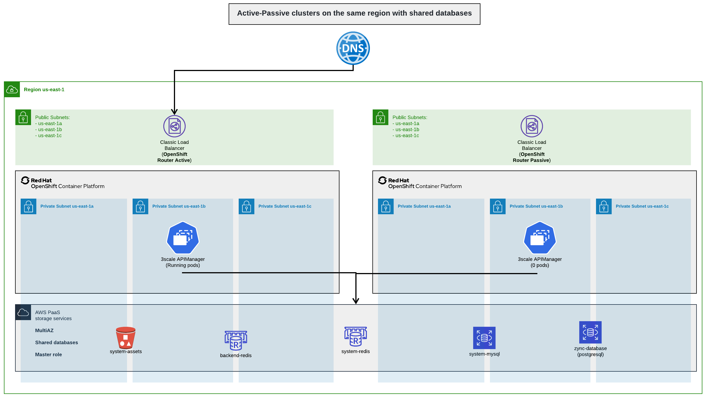
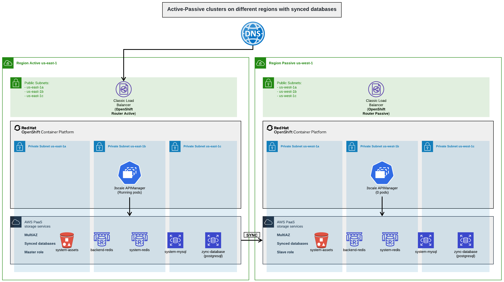

:toc:
:toc-placement!:

= 3scale HA different scenarios

toc::[]

== Highly available 3scale-operator based installation

This section explains how to install 3scale using the link:https://github.com/3scale/3scale-operator[3scale Operator] and how to configure it to have a highly-available deployment. If you haven't done so, you need to install the 3scale-operator following link:https://github.com/3scale/3scale-operator/blob/3scale-2.10-stable/doc/operator-user-guide.md#installing-3scale[this guide] before proceeding.

As usual, to install 3scale using the 3scale-operator, an APIManager custom resource is used (see a simple example link:https://github.com/3scale/3scale-operator/blob/3scale-2.10-stable/doc/operator-user-guide.md#basic-installation[here]), but several changes need to be made to ensure a highly-available installation. The following sections delve into each of the changes required.

=== External databases

The 3scale-operator installs all the databases required by 3scale within the OpenShift cluster by default. For a highly-available installation databases need to be external to the cluster though, so the user must deploy them himself outside the cluster and make the APIManager custom resource aware of it:

* Instruct the operator not to deploy the critical databases of the 3scale installation. Check the link:ha_dbs.adoc[3scale HA external databases documentation section] for this.
* Notice that the operator does not currently offer an option to deploy `system-memcached` or `system-sphinx` externally. Neither of these components have a critical impact on 3scale in the event they are down, so the operator does not currently support a high-available deployment option for them.

=== Scaling number of replicas

The number of replicas of each component needs to be at least 2 to support Pod failures. For installations with nodes running in different availability zones, the minimum replica count should match the number of availability zones available. This configuration used in combination with node-based Pod anti-affinity rules, described in the next section, will ensure that at least one Pod  will run in each availability zone. 3scale components that support more than one replicas are:

- apicast-production
- apicast-staging
- backend-listener
- backend-worker
- system-app
- system-sidekiq
- zync
- zync-que

Depending on your cluster size, throughput and latency requirements you might want to deploy more replicas, at least for the components that are called on each request to the APIs configured in 3scale, that is, `apicast-production`, `backend-listener`, and `backend-worker`.

Replicas can be configured using the `replicas` attribute in the APIManager spec.

=== Pod Affinity

Enabling Pod affinities in the operator for every component, ensures that Pod replicas from each DeploymentConfig are distributed across different nodes of the cluster, and evenly balanced across different availability zones. You can read more about affinities in the link:https://kubernetes.io/docs/concepts/scheduling-eviction/assign-pod-node/#affinity-and-anti-affinity[Kubernetes docs].

To enable affinities you need to follow link:https://github.com/3scale/3scale-operator/blob/master/doc/operator-user-guide.md#setting-custom-affinity-and-tolerations[these examples].

The following affinity block can be added for example to `apicastProductionSpec` (but can be added to any non-database DeploymentConfig), adds a *soft podAntiAffinity* configuration using `preferredDuringSchedulingIgnoredDuringExecution` (so the scheduler will try to run this set of `apicast-production` Pods in different hosts from different availability zones, but if it is not possible, then allow to run elsewhere):
```yaml
      affinity:
        podAntiAffinity:
          preferredDuringSchedulingIgnoredDuringExecution:
            - weight: 100
              podAffinityTerm:
                labelSelector:
                  matchLabels:
                    deploymentConfig: apicast-production
                topologyKey: kubernetes.io/hostname
            - weight: 99
              podAffinityTerm:
                labelSelector:
                  matchLabels:
                    deploymentConfig: apicast-production
                topologyKey: topology.kubernetes.io/zone
```
In the following example, unlike in the previous one, a *hard podAntiAffinity* configuration is set using `requiredDuringSchedulingIgnoredDuringExecution` (so conditions must be met for a Pod to be scheduled onto a node, otherwise Pod won’t be scheduled, which can be risky on certain situations like being on a cluster with low free resources, and new Pods cannot be scheduled):
```yaml
      affinity:
        podAntiAffinity:
          requiredDuringSchedulingIgnoredDuringExecution:
            - weight: 100
              podAffinityTerm:
                labelSelector:
                  matchLabels:
                    deploymentConfig: apicast-production
                topologyKey: kubernetes.io/hostname
            - weight: 99
              podAffinityTerm:
                labelSelector:
                  matchLabels:
                    deploymentConfig: apicast-production
                topologyKey: topology.kubernetes.io/zone
```

=== Pod Disruption Budgets

Enabling Pod disruption budgets (PDBs) ensures that a minimum number of Pods will be available for each component. You can read more about PDBs in the link:https://kubernetes.io/docs/concepts/workloads/pods/disruptions/#pod-disruption-budgets[Kubernetes docs].

Pod disruption budgets configuration is documented in link:https://github.com/3scale/3scale-operator/blob/3scale-2.10-stable/doc/operator-user-guide.md#enabling-pod-disruption-budgets[the user guide].

'''

The information provided above enables a basic highly-available installation, but you might need to take some extra steps depending on the environment where 3scale is running. Next, there are some of the most common scenarios described.

== Single cluster in single availability zone

With this setup, 3scale will continue working if a node fails, but stop working in case the availability zone fails.

Pod affinities do apply (but only using one rule with `kubernetes.io/hostname`), because there is a single availability zone.

Pod disruption budgets do apply.

== Single cluster in multiple availability zones

The same setup as before, but now nodes are distributed over hosts from different availability zones (physically separated locations or data centers within a cloud region that are tolerant to local failures).

A minimum of 3 availability zones is recommended to have high availability.

With this setup, 3scale will continue working if a node or even an availability zone fails at the same time.

Pod affinities do apply (with both rules `kubernetes.io/hostname` and `topology.kubernetes.io/zone`).

Pod disruption budgets do apply.

== Multiple clusters in multiple availability zones

There are several options to install 3scale across several OpenShift clusters and availability zones.

In multiple cluster installation options, clusters work in an *active/passive* configuration, with the *failover* procedure involving a few *manual* steps. Note that there will be service disruption while a human operator performs the required steps to bring the *passive* cluster into *active* mode in case of failure.

This documentation focuses on deployment using Amazon Web Services (AWS), but the same patterns and configuration options should apply to other public cloud vendors as long as the provider’s managed database services offer the required features (support for multiple availability zones, multiple regions …​).

=== Common configurations for multiple clusters installations

The following configuration items need to be used in any 3scale installations that involve using several OpenShift clusters:

* Use Pod affinities, with both `kubernetes.io/hostname` and `topology.kubernetes.io/zone` rules, in the APIManager custom resource.
* Use Pod disruption budgets in the APIManager custom resource.
* A 3scale installation over multiple clusters *must use the same shared `wildcardDomain`* attribute spec in the APIManager custom resource. The use of a different domain for each cluster is not allowed when in this installation mode as the information stored in the database would be conflicting.
* The secrets containing credentials like tokens, passwords, etc, have to be *manually* deployed in all clusters with the same values. By default, the 3scale operator creates them with some secure random values on every cluster. However, in this case, you need to have the same credentials in both clusters. The list of secrets and how to configure them can be found in the link:https://github.com/3scale/3scale-operator/blob/master/doc/apimanager-reference.md#apimanager-secrets[3scale Operator docs]. This is the list of secrets that should be mirrored in both clusters:
- backend-internal-api
- system-app
- system-events-hook
- system-master-apicast
- system-seed
* The secrets containing database connections strings (`backend-redis`, `system-database`, `system-redis`, `zync`) have to be *manually* deployed like explained on link:ha_dbs.adoc[external databases]:
- If databases are shared among clusters they must use the same values on all clusters
- On the other hand, if each cluster have their own databases, they must use different values on each cluster

=== Active-Passive clusters on the same region with shared databases



This setup consists of having 2 clusters (or more) in the *same region* and deploying 3scale in *active-passive* mode. One of the clusters will be the *active* (receiving traffic), whereas the other/s will be in standby mode without receiving traffic (*passive*), but prepared to assume the *active* role in case there is a failure in the *active* cluster.

In this installation option, given that only a single region is used, databases will be shared among all clusters.

==== Prerequisites and installation shared databases

. Create 2 (or more) OpenShift clusters in the *same region* using different availability zones. A minimum of 3 zones is recommended.
. Create all required AWS ElastiCache instances with Multi-AZ enabled:
.. One AWS EC for *Backend* redis database
.. One AWS EC for *System* redis database
. Create all required AWS RDS instances with Multi-AZ enabled:
.. One AWS RDS for the *System* database
.. One AWS RDS for *Zync* database (since 3scale version v2.10)
. Configure a AWS S3 bucket for the *System* assets
. Create a custom domain in AWS Route53 (or your DNS provider) and point it to the OpenShift Router of the *active* cluster (need to coincide with the `wildcardDomain` attribute from APIManager custom resource)
. Install 3scale in the *passive* cluster. The APIManager custom resource should be identical to the one used in the step above. After all the Pods are running, change the APIManager to deploy 0 replicas for all the Pods of apicast, backend, system, and zync. You want to have 0 replicas to avoid consuming jobs from the *active* database, etc. You can not tell the operator to deploy 0 replicas of each directly because the deployment will fail due to some Pod dependencies that cannot be met (some Pods check that others are running). That is why, as a workaround, first you deploy normally, and then, with 0 replicas. This is how it is specified in the APIManager spec:
```yaml
spec:
  apicast:
    stagingSpec:
      replicas: 0
    productionSpec:
      replicas: 0
  backend:
    listenerSpec:
      replicas: 0
    workerSpec:
      replicas: 0
    cronSpec:
      replicas: 0
  zync:
    appSpec:
      replicas: 0
    queSpec:
      replicas: 0
  system:
    appSpec:
      replicas: 0
    sidekiqSpec:
      replicas: 0
```

==== Manual Failover shared databases [[manual-failover-shared-databases]]

. In the *active* cluster, scale down the replicas of the *Backend*, *System*, *Zync* and *Apicast* Pods to 0, it will become the new *passive* cluster, so you ensure that the new *passive* cluster will not consume jobs from *active* databases (*downtime starts here*)
. In the *passive* cluster, edit the APIManager to scale up the replicas of the *Backend*, *System*, *Zync* and *Apicast* Pods that were set to 0, so it will become the *active* cluster
. In the newly *active* cluster (ex *passive*), recreate the OpenShift Routes created by *Zync*. To do that, run `bundle exec rake zync:resync:domains` from the `system-master` container of the `system-app` Pod. In 3scale version v2.9, this command fails sometimes, so you can retry until all the Routes are generated
. Point the custom domain created in AWS Route53 to the OpenShift router of the new *active* cluster
. From this moment, the old *passive* cluster will start to receive traffic, and it becomes the new *active* one

=== Active-Passive clusters on different regions with synced databases



This setup consists of having two clusters (or more) in *different regions* and deploying 3scale in *active-passive* mode. One of the clusters will be the *active* one (receiving traffic), whereas the other will be in standby mode without receiving traffic (*passive*) but prepared to assume the *active* role in case there is a failure in the *active* cluster.

In this setup, to ensure good database access latency, each cluster will have its own database instances. The databases from the *active* 3scale installation will be replicated to the read-replica databases of the 3scale *passive* installations so the data is available and up to date in all regions for a possible failover.

==== Prerequisites and installation synced databases

. Create 2 (or more) OpenShift clusters in *different regions* using different availability zones. A minimum of 3 zones is recommended.
. Create all required AWS ElastiCache instances with MultiAZ enabled *on every region*:
.. Two AWS EC for *Backend* redis database (one per region)
.. Two AWS EC for *System* redis database (one per region)
.. But on that case use the link:https://docs.aws.amazon.com/AmazonElastiCache/latest/red-ug/Redis-Global-Datastore.html[cross-region replication with Global Datastore feature enabled], so the databases from *passive* regions will be read-replicas from the master databases at the *active* region
. Create all required AWS RDS instances with Multi-AZ enabled *on every region*:
.. Two AWS RDS for the *System* database
.. Two AWS RDS for *Zync* database (since 3scale version v2.10)
.. But on that case use link:https://docs.aws.amazon.com/AmazonRDS/latest/UserGuide/USER_ReadRepl.XRgn.html[cross-region replication], so the databases from *passive* regions will be read-replicas from the master databases at the *active* region
. Configure a AWS S3 bucket for the *System* assets *on every region*, but on that case use link:https://docs.aws.amazon.com/AmazonS3/latest/userguide/replication.html#crr-scenario[cross-region replication]
. Like on previous scenario, create a custom domain in AWS Route53 (or your DNS provider) and point it to the OpenShift Router of the *active* cluster (need to coincide with the `wildcardDomain` attribute from APIManager custom resource)
. Like in the previous scenario, install 3scale in the *passive* cluster. The APIManager custom resource should be identical to the one used in the step above. After all the Pods are running, change the APIManager to deploy 0 replicas for all the Pods of apicast, backend, system, and zync. You want to have 0 replicas to avoid consuming jobs from the *active* database, etc. You can not tell the operator to deploy 0 replicas of each directly because the deployment will fail due to some Pod dependencies that cannot be met (some Pods check that others are running). That is why, as a workaround, first you deploy normally, and then, with 0 replicas

==== Manual Failover synced databases

. Execute step 1, 2 and 3 from <<manual-failover-shared-databases>>
. Every cluster has its own independent databases (read-replicas from the master at the *active* region), so it is required to *manually* execute a failover on every database to select the new master on the *passive* region (which will become now the *active* region)
. Manual failovers of the databases to execute are (order does not matter):
.. AWS RDS: *System* and *Zync*
.. AWS ElastiCaches: *Backend* and *System*
. Execute step 4 and 5 from <<manual-failover-shared-databases>>

=== Active-Active clusters (not supported)

Having an application working on *active/active* configuration is always difficult for any application:

- *Soft Databases limitation*: it is complex but can be achieved with some trade offs, but it is mainly responsibility from the administrator (not 3scale responsibility)
- *Hard Application limitation*: this one is a hard limitation imposed by how 3scale manages OpenShift Routes and cannot be achieved

==== Soft Databases limitation (out of 3scale scope)

One of the most difficult parts for any application deployed on *active*/*active* (not only 3scale), is having databases on *active*/*active* mode, and in case of 3scale there are many different databases involved which would require different *active*/*active* implementations for each of them:

- System-mysql (or system-postgres or system-oracle, you can choose)
- System-redis
- Backend-redis
- Zync-database (postgresql)
- system-sphinx (doesn't need HA)
- system-memcached (doesn't need HA)

So, from 3scale point of view, an administrator need to ensure that database connection strings configured in 3scale APIManager custom resource on any OCP cluster will be always a master instance (allowing write operations).

____
*NOTE*

*This database limitation is a soft limitation because although being very complex (implementing active/active for mysql, postgresql or redis is not trivial), it can be achieved.*
____

==== Hard Application limitation: OpenShift Routes

The main reason why *active*/*active* can not be achieved, even with *active*/*active* databases, is *System* dev/admin portals and *Apicasts* OpenShift Routes. They are  managed by the *Zync* component and they need to be the exactly the same on all OCP clusters.

This is an example flow since a client wants a *System* new dev portal and incoming traffic can eventually reach system-app pods thanks to a newly created OpenShift Route:

. System-app receives the request from UI/API to create a dev/admin portal or apicast OpenShift  Route
. System-app enqueues the background job to create those OpenShift Routes into system-redis
. System-sidekiq takes the job from system-redis, process it and contacts with zync API (zync deployment)
. Zync API (zync deployment) creates a background job into zync-database (postgres)
. Zync-que takes the route-creation-job from zync-database (postgres) and create the final OpenShift  Routes into the cluster that proccessed that job

When having N clusters, imagine Cluster-A and Cluster-B, any of them can receive traffic managed by either Cluster-A-system-app or Cluster-B-system-app, so they will enqueue the job into its own database, and would follow the whole procedure:

```
System-app -> system-redis -> system-sidekiq -> zync (api) -> zync-database -> zync-que -> OpenShift Routes creation
```

And finally, the OpenShift Routes will be created *only* into the cluster that processed the route-creation-job (not on both OCP clusters), so incoming traffic managed by OpenShift Router will work only on one cluster (the one with the needed OpenShift Routes), so not having *active*/*active*.

____
*NOTE*

*This application limitation is a hard limitation because the first worker that fetches the job, will create the OpenShift Route on the cluster it's running. So, each cluster will have a subset of OpenShift Routes.*
____

=== Active independent clusters

A few customers wanting *active*/*active*, as it can not be achieved within the same 3scale instance due to the hard limitation imposed by the OpenShift Routes created by *Zync*, what they have done is to deploy 3scale independent instances on different OCP clusters, where every 3scale instance has its own databases, which are not shared and not synced between them.

Here you can find some considerations:

- Each 3scale independent instance will need its own High Availability configuration
- You need to manage the 3scale configuration with a shared CI/CD, to ensure that any independent 3scale instance will have exactly the same configuration
- You need a kind of Global Load Balancer (maybe done at DNS level above all OCP clusters), to ensure that the same % of traffic goes to every independent 3scale instance on its OCP cluster (maybe using round-robin policy)
- The rate limit will be independent for every 3scale instance, so if for example you have 2 3scale independent instances, and want a global rate limit of 100 requests/minute, you will need to configure a rate limit of 50 requests/minute on each 3scale instance, and in case of having round-robin DNS policy on the Global Load Balancer, *theoretically* you will achieve the supposed global 100 requests/minute rate limit